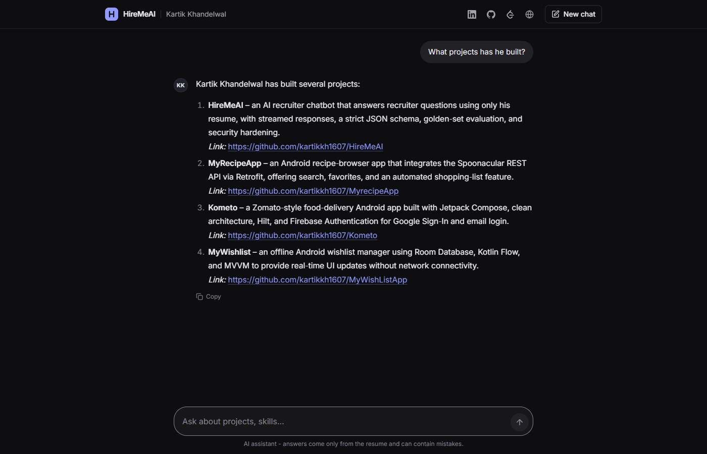
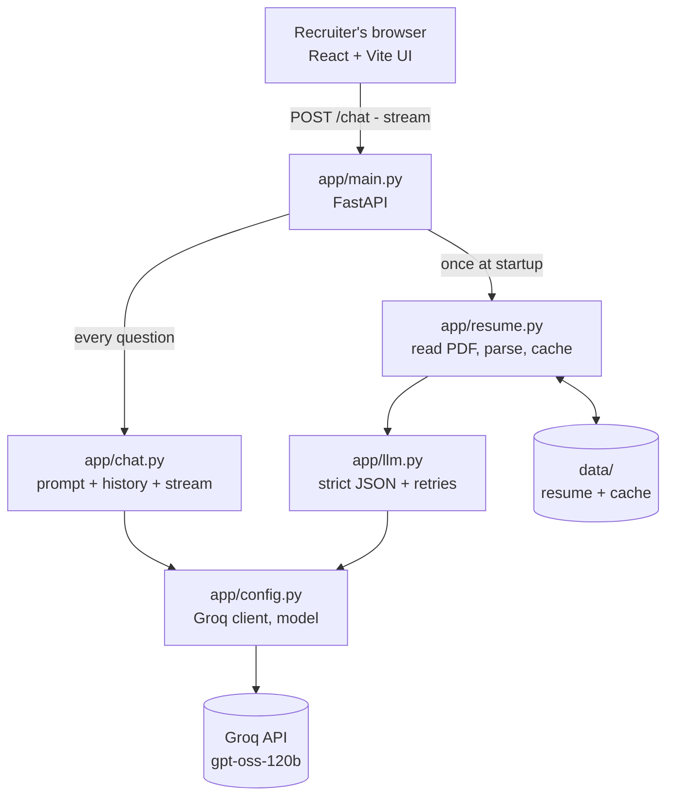

# HireMeAI

**A recruiter-facing chatbot that answers questions about me — grounded only in my resume.**

Recruiters can ask things like *"What has he built?"*, *"Has he done any hackathons?"* or *"Does he know Kubernetes?"* and get short, honest answers with links — streamed in real time. If something is not in the resume, the bot says so instead of making it up.

> **Live demo:** https://hiremeai-kartik.onrender.com



---

## Features

- **Resume → structured data** with strict JSON-schema output (Pydantic + Groq structured outputs)
- **Parse once, ship the result** — the resume is parsed locally and the validated result is committed as a cache (`data/resume_cache.json`), so production startup makes zero LLM calls. The cache key covers the file, prompt and model; parser code changes still need a manual `PARSER_VERSION` bump in `app/resume.py`
- **Streaming chat** with multi-turn memory (sliding window of the last 10 messages)
- **Grounded answers** — no invented skills, no exaggerated skill levels, honest "not in the resume" replies
- **Privacy by design** — the phone number is parsed but never sent to the chat model
- **Prompt-injection & XSS defenses** on both the backend and frontend
- **Abuse limits** — per-IP rate limiting, history size caps and a per-answer token cap (see [Security & limits](#security--limits))
- **Golden-set eval** for the resume parser (`eval_resume.py`)
- ChatGPT-style **React + Vite** UI served by FastAPI

## Architecture



**Two flows:**
1. **Startup (once):** if the committed cache matches the current resume, prompt and model, load it instantly; otherwise read PDF → extract text + hidden hyperlinks → LLM parses into a strict `Resume` schema → post-process → cache to disk.
2. **Every question:** system prompt (resume JSON, phone removed) + last 10 messages + question → streamed answer.

The expensive work (parsing) happens once; each question is a single cheap chat call.

| File | Responsibility |
|---|---|
| `app/config.py` | Env vars, Groq client, model name |
| `app/schemas.py` | Pydantic models — the shape of all data |
| `app/llm.py` | Reusable strict-JSON LLM call with retry policy |
| `app/resume.py` | PDF/DOCX reading, link extraction, parsing, caching |
| `app/chat.py` | System prompt + streaming answers |
| `app/main.py` | FastAPI: startup, validation, endpoints |
| `frontend/` | React + TypeScript + Tailwind chat UI (built into `static/`) |
| `tests/` | pytest suite (FastAPI `TestClient`, Groq mocked) |
| `scripts/` | Manual `try_*.py` experiments that call Groq |

## Engineering decisions (and the bugs that led to them)

Most of the design came from things that broke during testing:

- **Hidden hyperlinks.** `pypdf.extract_text()` only returns visible text ("GitHub", "View Project →"), not the URLs behind them. Links are pulled from PDF annotations and appended to the text, so project repos are now captured.
- **Silent data loss from schema gaps.** In strict mode, the model can only fill fields that exist. The "Achievements" section and coursework silently disappeared until they were added to the schema.
- **Ambiguous fields cause regressions.** A single `description` field sometimes got the subtitle and sometimes the bullet points. Splitting it into `description` + `highlights` made output stable.
- **Code over prompts.** The model kept listing certifications as skills even when told not to (the resume itself lists them under skills). A deterministic post-processing filter fixed it — and the first version of that filter was itself brittle, which a stronger eval caught.
- **Cache keys must include everything that changes output** — file bytes, prompt, model and a manual parser version.
- **Hide data *and* tell the model.** Removing the phone number made the bot claim "the resume has no phone number" — technically a lie. The prompt now states it is intentionally withheld.
- **Retry only transient errors.** 429 / 5xx / network / invalid JSON are retried with exponential backoff; auth errors, bad requests and truncated output are not.
- **Production startup must not depend on an LLM.** After a resume update, a redeploy on Render failed while the same code had just started fine. `gpt-oss` is a reasoning model, its thinking tokens count toward the output limit, and on a longer run the JSON got cut off. In strict mode Groq reports this as a `400 json_validate_failed`, not `finish_reason == "length"`, so the truncation check never fired. Fix: an explicit `max_completion_tokens` (8192) for structured calls in `app/llm.py`, and the parsed resume is committed so the server starts in milliseconds without calling Groq.
- **Stateless server.** Chat history lives in the browser and is sent with each request, so the backend needs no database or sessions.

## Evaluation

`eval_resume.py` checks the parser against a golden set built by reading the resume by hand (links, project repos, bullet points, achievements, coursework, certification formatting, no certifications in skills). The checks are intentionally independent of the parser's own logic, so a bug in the filter can't also hide in the test.

```
7/7 checks passed
```

The chat was red-teamed manually: follow-up questions, missing skills (Kubernetes), exaggeration ("is he an expert in Python?"), privacy (phone number), off-topic and injection prompts.

## Tech stack

**Backend:** Python 3.11, FastAPI, Pydantic v2, Groq (`openai/gpt-oss-120b`), tenacity, pypdf, python-docx, uv

**Frontend:** React, TypeScript, Vite, Tailwind CSS, react-markdown

**Testing & deploy:** pytest, Render

## Run locally

Requirements: Python 3.11+, [uv](https://docs.astral.sh/uv/), Node 20.19+ (only to rebuild the UI), a free [Groq API key](https://console.groq.com).

```bash
git clone https://github.com/kartikkh1607/HireMeAI.git
cd HireMeAI
uv sync

# 1. Create a .env file in the project root with one line:
#    GROQ_API_KEY=your_key_here
#    (On Windows, create it in your editor - PowerShell's echo writes UTF-16)

# 2. (Optional) Use your own resume
#    replace data/my_resume.pdf, then run
#    uv run python eval_resume.py
#    to re-parse it and refresh data/resume_cache.json
#    (and update the golden values in eval_resume.py for that resume)
#    Note: the chat prompt (app/chat.py) and some UI copy are written for my
#    resume (e.g. he/his, card subtitles) - edit them when reusing it.

# 3. Run
uv run uvicorn app.main:app --reload
# open http://127.0.0.1:8000
```

Frontend development (hot reload):

```bash
cd frontend
npm install
npm run dev        # http://localhost:5173 (proxies API calls to :8000)
npm run build      # outputs to ../static, served by FastAPI
```

Useful scripts:

```bash
uv run pytest                        # tests - no Groq calls, runs in ~1s
uv run python eval_resume.py         # parser golden-set eval (uses the cached parse)
uv run python -m scripts.try_chat    # chat in the terminal (real Groq calls)
```

`scripts/try_*.py` are manual experiments that call Groq for real; run them from the project root with `python -m` so `app` is importable. They are not part of the test suite.

Production notes:

```bash
# ENV=production turns off /docs, /redoc and /openapi.json
# --proxy-headers makes the rate limiter see the real client IP behind a proxy (e.g. Render)
ENV=production uv run uvicorn app.main:app --host 0.0.0.0 --port $PORT --proxy-headers --forwarded-allow-ips="*"
```

## Security & limits

| Protection | How |
|---|---|
| Rate limit (per IP) | `POST /chat`: 10 requests/minute and 100/day per IP → `429` with a JSON `detail` and `Retry-After` header. Best-effort only (see below) |
| Rate limit (global) | 30 requests/minute and 300/day across **all** clients, regardless of IP → `429` "The assistant is busy right now". This is the cap that actually protects the Groq quota. Requests blocked by the per-IP limit don't count against it |
| Only valid requests count | Rate limits are checked after the request body is validated, so invalid requests (`422`) never use up the per-IP or global budget |
| Request size | Question 1–1000 chars; history max 20 messages, each max 4000 chars (the UI sends only the last 10) |
| Token cap | `max_completion_tokens=1500` per answer (includes the reasoning tokens of `gpt-oss`); truncated answers end with *(answer truncated)* |
| Privacy | The phone number is parsed but never sent to the chat model or returned by `/profile` |
| Role injection | History roles are limited to `user` / `assistant` — a `system` message is rejected with `422` |
| Prompt injection | Resume and questions are treated as data, not instructions (system prompt rules) |
| XSS | The UI renders answers with `react-markdown` (no raw HTML), allows only `http(s)` links and never loads images |
| Errors | Upstream failures before the first token return `503`; mid-stream failures end with a sentinel the UI turns into an error with Retry |
| API docs | Disabled when `ENV=production` |

**Known limitations**

- **Per-IP limits can be bypassed.** Behind a proxy, uvicorn must run with `--proxy-headers --forwarded-allow-ips="*"`, otherwise every visitor shares the proxy's IP. But with `"*"` uvicorn trusts the *left-most* `X-Forwarded-For` value, which the client controls, so a client can send a fake IP on every request and never hit the per-IP limit. The per-IP limit is therefore a fairness measure for normal users. The global limit is the real protection: spoofing can at most use up the global budget (making the bot "busy" for others until the window resets), never more Groq calls than that.
- The rate limiters are in-memory and per process: counts reset on restart and are not shared across multiple instances or workers (fine for a single instance; use Redis to scale out).
- The server is stateless, so it trusts the history the browser sends. A client can fabricate earlier "assistant" turns — but that only affects their own conversation, never other users. Low risk by design.

## API

| Method | Path | Description |
|---|---|---|
| `GET` | `/health` | Liveness check |
| `GET` | `/profile` | Parsed resume (phone removed) |
| `POST` | `/chat` | `{ "question": str, "history": [{role, content}] }` → streamed `text/plain` (`422` invalid input, `429` rate limited, `503` AI service unavailable) |

## Roadmap

- [x] Deploy with a public demo link
- [ ] LLM-as-judge eval for chat answers (groundedness, no exaggeration)
- [ ] Job-description matching: paste a JD, get a grounded fit summary

## Credits

The idea comes from the HireMeAI exercise in [Padho with Pratyush — AI Engineer course](https://github.com/perryvegehan/padho_with_pratyush_Ai_Enginner). This version was rebuilt from scratch with a modular architecture, strict structured outputs, caching, evals, privacy and security hardening, streaming and a new UI.